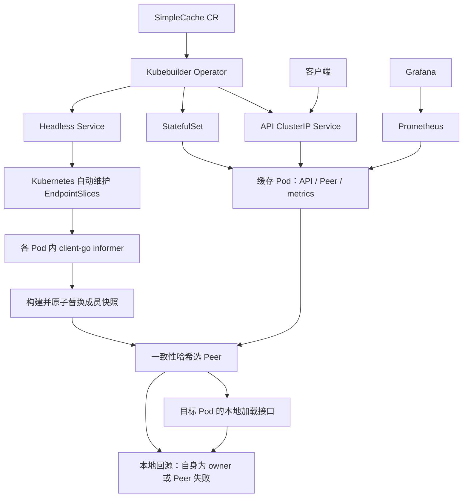

# SimpleCache 改造设计

状态：实施中，功能完成情况与检查结果见 PLAN.md 和 README.md；本文描述目标方案，不代表所有功能已经实现或性能已经测得。

目标：让项目实现、可复现实验和 `20260923_简历_郑熙坤.pdf` 中的 SimpleCache 描述逐项对应。以旧项目为基础，优先补齐动态成员、故障降级、观测和验证，不扩展为通用缓存数据库。

当前优先功能交付，按 PLAN.md 合并为 5 个实现提交，预计约 3–5 个完整开发日。默认不运行重压测，负载工具、长时间实验与性能报告放到功能完成后再选做；镜像、依赖与 Kind 环境问题可能增加时间。这是工作量估计，不是完成承诺。

## 1. 现状与差距

初始审阅来源：原 `../simplecache-project`；仓库现已整体迁移到当前 `simpleCache/`。初始设计阶段仅静态审阅，后续实施检查结果见 [PLAN.md](PLAN.md)。本节现状表保留初始差距，完成状态以 README/PLAN 为准。

| 简历能力 | 旧项目现状 | 本轮工作 |
| --- | --- | --- |
| 本地缓存 | `geecache/cache.go` 包装加锁 LRU，已有容量和 TTL 接口 | 修复 LRU 新插入 entry 未赋值 `expireAt`；补过期与淘汰测试 |
| 一致性哈希 | `consistenthash/consistenthash.go` 有虚拟节点和 CRC32 | 保留算法，统一稳定节点 ID，确定性排序和去重 |
| 节点间通信 | `geecache/http.go` 使用 HTTP + Protobuf | 保留协议，补超时、错误处理、响应大小限制、单跳约束 |
| SingleFlight | 自实现 `singleflight.Group` | 使用标准扩展库，增加闭包内二次查缓存，区分路由与本地加载 |
| Bloom Filter | `NewGroup` 硬编码 Tom/Jack/Sam | 从同一有限数据集构建，修复与 `Auto-*` 压测不匹配的问题 |
| Operator | 已创建 StatefulSet 和 Headless Service，更新副本及镜像 | 补幂等更新、子资源 Watch、RBAC、探针、Status 和可运行样例 |
| 动态成员 | Operator 拼接 `PEERS`，通过 Pod 环境变量发布 | 替换为缓存进程 Watch EndpointSlice |
| 原子更新环 | `HTTPPool.Set/PickPeer` 使用互斥锁 | 构建完整不可变快照，用 `atomic.Pointer` 发布 |
| 故障降级 | 获取 Peer 失败后有本地回源逻辑 | 补 Peer 超时、实际错误日志、正确错误分类和故障测试 |
| 可观测性 | 一个混合请求计数器；Prometheus 静态抓取五个 Pod | 明确指标口径，动态发现，交付 Grafana dashboard |
| 稳定性与性能验证 | 一个自动启动三进程的测试，统计成功数和 QPS | 隔离旧压测，补轻量功能验证；性能报告暂缓 |

其他必须修复的问题：

- Peer Handler 中 `group.Get` 的错误随后被 `proto.Marshal` 的错误覆盖，可能把失败编码成成功空值。
- Peer Handler 调用普通 `Get`，动态成员引入后可能再次转发。不同环视图下会形成 A→B→A，并与同 Key 的 SingleFlight 互相等待。
- `main.go` 在注册 Peer 前启动 API goroutine，初始化顺序应调整。
- Service 查询的非 NotFound 错误未正确终止；部分 owner reference 错误未处理。
- Operator 当前生成的 Role 仅包含 CR 权限，缺少实际创建 Service/StatefulSet 的权限；样例 CR 和 controller 测试仍缺必填 Spec。

## 2. 范围和语义

实现一个面向高并发读的、内存型 cache-aside 缓存集群。每个节点都能访问同一权威数据源；一致性哈希决定优先访问哪个缓存节点，不承担数据复制或强一致性。

第一版使用进程内的只读演示数据源：从固定 seed 生成 `Auto-0` 至 `Auto-9999`，加上原有三个 Key；所有 Pod 使用相同生成规则和版本。回源默认延迟 100ms，用可取消的 timer 模拟，缺失 Key 返回 `ErrNotFound`。Bloom 和数据源从同一份 Key 集合初始化。

这足以验证缓存链路，README 必须说明“演示数据源”，不能把测试结果描述为真实数据库性能。Getter 接口保留替换真实数据源的能力，但本轮不引入 MySQL、Redis 或外部持久化依赖。

边界：

- 没有写入、删除 API，不承诺缓存与数据库的强一致性。
- 内存缓存可丢失，节点重启后通过回源恢复；不配置 PVC。
- 成员视图最终收敛，快照原子发布只保证单进程读到完整状态，不保证全体节点同时切换。
- 故障 fallback 会增加回源压力，SingleFlight 只在单进程内合并，不能保证故障时全局只回源一次。
- 扩缩容不搬迁缓存，受影响 Key 在新 owner 按需重建；旧节点缓存自然过期或淘汰。
- 全部缓存节点不可达、入口 Pod 被杀、权威源不可用时，无法保证请求成功。

暂不做 Raft、缓存副本、全局锁、自动扩缩容、跨集群、主动迁移、服务网格、分布式追踪、复杂熔断或多租户。上述能力不影响当前简历描述的兑现。

## 3. 架构与职责



Operator 管理期望配置；Kubernetes 维护就绪端点；缓存进程消费端点并选路。成员信息不写入 CR Status/ConfigMap，不经 Operator 二次转发。

部署两个监听端口：Peer `8001`，API/健康检查/metrics `9999`；API 与 metrics 共用端口、分开 Handler。Headless Service 仅声明 Peer 端口；API Service 声明 `9999`。两个 Service 都使用带集群实例名的 selector，避免不同 CR 混入同一成员集合。

## 4. 读请求、超时与 SingleFlight

### 4.1 入口流程

`GET /api?key=<key>`：

1. 校验 Key（非空，最大 256 字节），建立请求 deadline。
2. 查询本地 LRU；命中直接返回。
3. 若已完成初始化的 Bloom 判定一定不存在，返回 404，不请求 Peer 或数据源。
4. 进入该 Group 的 `routeFlight`，相同 Key 合并；闭包内再次查 LRU。
5. 从一个快照中选择 owner；owner 为自身或环为空，调用本地加载。
6. owner 为远端，最多请求一次 Peer。
7. Peer 成功返回数据；只有明确的 `KEY_NOT_FOUND` 才直接返回业务 404；未知 Group、网络错误、超时、5xx、协议错误则尝试本地回源。
8. 本地加载成功写 LRU；失败返回明确错误。所有路径均受时间预算约束。

第一版不把 Peer 成功结果写入入口节点 LRU：保留按 owner 分片的基本行为，避免引入热点副本策略。SingleFlight 合并同时发生的加载，不消除持续热点的 Peer 流量；热点仍可能集中到 owner，先测量再决定是否引入副本。fallback 结果可以缓存到本地，即使 owner 恢复，也允许后续至 TTL/淘汰前本地命中；对只读数据这是可接受的降级行为。

### 4.2 Peer 只执行本地加载

保留 HTTP + Protobuf，但 Peer Handler 使用 `GetLocal(ctx, key)`，永不调用 `PickPeer`。本地加载依次查 LRU、Bloom、进入独立的 `originFlight`、二次查 LRU、获取节点回源名额、调用 Getter、释放名额、写 LRU。

`routeFlight` 和 `originFlight` 是两个独立实例，禁止在同一 SingleFlight 中同 Key 递归。这样远端节点即使认为 owner 已迁移，也会直接完成请求，避免转发环和自等待。读取成功后才 Marshal；解码或请求参数错误返回 400，超时返回 504，源故障返回 503。

Peer 错误响应采用 HTTP 状态加 `X-SimpleCache-Error` 固定错误码，不修改成功响应的 Protobuf schema：Key 不存在为 `404 + KEY_NOT_FOUND`，Group 不存在为 `404 + GROUP_NOT_FOUND`。只有前一种组合代表业务缺失；后一种记录配置错误并触发入口本地回源。缺少错误码的 404、无法识别的错误响应视为 Peer 协议错误并降级，不能解析自由文本判断 Key 是否存在。指标中 `GROUP_NOT_FOUND` 归为 Peer error；若 fallback 成功，外部请求仍记为 ok。

### 4.3 时间预算

初始默认值为：外部请求 1500ms、一次路由共享工作 1200ms、Peer 300ms、一次本地源加载 800ms。Peer 失败后 fallback 的等待使用路由工作剩余预算，不能给等待重新分配完整预算。Peer 子 context 同时受路由剩余预算和 300ms 限制，HTTP Client Timeout 为 300ms；Getter 必须接受 context 并响应取消。

使用 [`golang.org/x/sync/singleflight.DoChan`](https://pkg.go.dev/golang.org/x/sync/singleflight)。调用者可在自己的 `ctx.Done()` 时停止等待；共享工作使用进程生命周期 context 派生的有限 deadline，避免首个客户端断开取消整批请求。每次等待 DoChan 结果都必须同时 select 对应等待 context，不能无界等待。

- 外部调用者达到自己的 deadline 后返回，即使共享路由仍在运行。
- 路由工作达到 1200ms deadline 后停止等待源加载并返回超时；路由完成时间不被独立源加载拖长。
- 独立源加载的 800ms 从 `originFlight` 闭包开始计算，包括等待回源名额和执行 Getter；它不继承首个等待者或路由的取消。路由已返回时，源加载仍可在自己的剩余预算内完成，成功结果写入缓存，超时则退出。
- 进程关闭时取消所有共享工作；本轮不增加等待者引用计数，也不为超时调用者调用 `singleflight.Forget`。该接口会允许后续请求启动新工作，可能破坏同 Key 的合并。

因此“请求等待有上限”和“后台源加载可能稍晚结束”同时成立。后台剩余工作始终有自己的有限 deadline，并占用同一个回源并发上限。

复用 HTTP Client/Transport；设置空闲连接池和 HTTP Server 的 header/idle 超时。分别定义 `MaxValueBytes = 1 << 20` 和 `MaxPeerBodyBytes = MaxValueBytes + 1024`；后者给当前仅有 bytes value 的 Protobuf 响应留出封装余量。服务端先验证 Value 长度与 `proto.Size`，客户端最多读取 body 上限加一字节来识别超限，解码后再次检查 Value 上限。协议将来增加字段时需重新检查封装预算，不能把编码后的大小等同于 Value 大小。统一 URL 编解码并测试空格、中文和斜杠 Key；检查所有 HTTP 状态和 Protobuf 错误。

### 4.4 每节点回源并发上限

SingleFlight 只能合并同 Key，不限制不同 Key。每个缓存进程共享一个有容量的 channel，默认 `SOURCE_MAX_CONCURRENCY=32`，供该进程全部 Group 的实际 Getter 使用；支持环境变量调整并校验为正数，第一版不增加 CR 字段。

获取名额放在 `originFlight` 闭包二次查缓存之后、调用 Getter 之前，通过 select 同时等待名额和源工作 `ctx.Done()`；获取后再次检查 context，Getter 结束通过 defer 释放。排队时间计入 800ms 源工作预算，排队超时不调用 Getter、不增加实际源调用计数。同 Key 的合并等待者不各占名额。

测试确认实际同时运行的 Getter 不超过上限、排队取消不泄漏名额、不同入口（API 本地与 Peer）共用上限。此限制按节点生效，集群总回源并发最多随运行副本数增加；它不提供全局源保护，也不限制所有排队请求的数量。根据容量压力和故障实验调整上限，不引入 worker pool、分布式限流或熔断。

## 5. 动态成员与不可变快照

### 5.1 成员发现

缓存进程使用 namespaced EndpointSlice informer，仅订阅 `kubernetes.io/service-name=<cluster>-peers`。Add/Update/Delete 事件只入队，由一个 worker 从 informer store 汇总该 Service 的**全部** slices，构建候选成员集合。使用 client-go 的重连/relist 机制，不自写长连接协议。

EndpointSlice 的就绪语义及 Service 关联标签遵循 [Kubernetes 官方说明](https://kubernetes.io/docs/concepts/services-networking/endpoint-slices/)；实现时再核对固定依赖版本的 API 注释。本项目明确采用以下策略：`ready=false` 排除，`ready=nil` 按未知但可用处理，`terminating=true` 一律排除。Headless Service 保持 `publishNotReadyAddresses=false`。

第一版仅部署 IPv4 单栈 Kind：选择 IPv4 slices、名称为 `peer` 的 TCP 端口和 Pod 类型 TargetRef，缺少必要字段的端点跳过并记录日志。双栈及外部手写 EndpointSlice 不在验收范围。

节点 ID 使用 `namespace/podName`，与 Downward API 提供的自身 ID 一致；Transport 地址使用 slice 中的 Pod IP 和 Peer 端口。Pod 重建换 IP 时 owner ID 不变，但 getter 地址必须更新。多个 slices 中相同 ID 去重并确定性选取；发生地址冲突记录日志，不能依赖 map 遍历顺序。

启动时先初始化数据、Bloom、空快照和 Peer 注册，再启动 HTTP listener/informer。`/readyz` 在数据初始化、listener 可用且首次 informer 同步成功后才返回成功；不等待自己已出现在 EndpointSlice，也不等待整个集群就绪，避免 readiness 与端点发布互相等待。

首次同步前不接收外部流量；同步后即使成员数为零也允许本地回源。Watch 暂时中断时保留最后一次有效快照，不清空成员；恢复后自动收敛。没有事件不能被当作 Watch 断开，指标和日志记录真实错误。正常、有效的空列表需要发布空环，不能混同 API 查询失败。

### 5.2 快照结构与发布

```go
type PeerSnapshot struct {
    Ring    *consistenthash.Map
    Getters map[string]*httpGetter // key 为稳定节点 ID
    Members []Member              // 按 ID 排序
    Version uint64                // 本地发布次数，不是全局版本
}

type HTTPPool struct {
    selfID string
    state  atomic.Pointer[PeerSnapshot]
}
```

由单个更新 worker 排序、去重、构建新的环和 getters 后一次 `Store`；发布后 map、slice、ring 及 getter 配置均不可再修改。每次 `PickPeer` 只 `Load` 一次，从同一快照取 owner 与 getter。Go 的 [`sync/atomic`](https://pkg.go.dev/sync/atomic) 提供原子指针；不可变性由项目实现保证。

成员集合的比较包括 ID、IP、端口；相同集合不重建、不增加成员变化计数。虚拟节点使用带分隔符的 `replicaIndex:nodeID`，默认每节点 100 个，哈希位置用 `uint32`，避免平台整数宽度影响。碰撞处理采用稳定排序/固定决胜规则，各节点同成员集必须得到同一映射。

旧请求持有旧 getter 仍可完成或超时；新请求读取新快照。成员变化不主动清空缓存，不停止读请求。快照指针原子发布无需读路径持有成员锁；本地 LRU 仍使用已有互斥锁。

本地开发保留显式 `DISCOVERY_MODE=static` 和静态成员配置；静态模式同样通过快照发布。Kubernetes 模式发现失败不能悄悄退回 localhost 三节点。

## 6. Bloom 与本地缓存

Bloom 在启动时从完整只读数据集构建，构建完成后只读，不提供运行期 Add，避免位图并发读写。不能在缓存 miss 后才把 Key 加入过滤器，否则第一次合法读取会被误拒绝。初始化失败时启动失败，不能拿不完整过滤器拦截请求。

用双哈希生成多个 bit 位置，校验容量和哈希次数；根据数据规模与目标误判率约 1% 计算参数。理论误判率与实际实验结果分开记录。保证所有真实 Key 不被过滤；“可能存在”仍需向源查询，不能直接视为存在。

本轮不缓存 NotFound；Bloom 的假阳性可能引起回源，这是设计允许的情况。未来引入动态写入时，需要重新设计过滤器更新协议，本轮不能把静态策略宣传成支持任意动态数据源。

LRU 默认逻辑容量 64MiB，TTL 60s，惰性清理过期条目；容量统计只含 Key/Value 字节，不等于进程 RSS。单值限制 1MiB，不接受零容量代表无限缓存；修复新增 entry 的 TTL，保留 ByteView 深拷贝隔离。Pod memory limit 为 256MiB 起步，压测后校准。

## 7. Operator 设计

沿用现有 Kubebuilder 项目、API Group `cache.x1kun.com/v1`、Kind `SimpleCache` 和 Spec 字段 `size/image`，避免无意义迁移。移除未使用的 `foo`。

Spec 最小集合：`size`（默认 3，范围 1–10）、`image`（必填非空）、`cacheBytes`（默认 67108864，范围 1MiB–128MiB）、`ttlSeconds`（默认 60，范围 1–3600）、`resources`（可选，提供默认 requests/limits）。超时、demo seed、数据集规模第一版使用固定默认配置，不把每个实现参数都暴露成 CR 字段。

Reconcile 管理 StatefulSet、Headless Service、API Service、缓存专用 ServiceAccount、namespace Role 和 RoleBinding，所有资源设置 owner reference 并检查错误。只更新由 Operator 管理的字段，Service 更新保留 Kubernetes 分配的 ClusterIP 等字段；检查同名非己方资源，冲突时报告而非接管。

StatefulSet 使用 `Parallel` PodManagementPolicy、标准 RollingUpdate，注入 Pod 名称、namespace、目标 Headless Service 名称和缓存参数。`spec.size` 变化仅更新 replicas，不改变 Pod template；因此扩缩容不会为了改 `PEERS` 而重启已有 Pod。镜像和缓存配置变更允许滚动更新。

StatefulSet 的稳定身份和并行 Pod 管理能力见 [官方文档](https://kubernetes.io/docs/concepts/workloads/controllers/statefulset/)。本项目采用 Parallel 是为了加速独立缓存节点启动；不依赖启动顺序。

探针：startup/liveness 检查 `/healthz`，readiness 检查 `/readyz`。SIGTERM 先进入不就绪状态，然后 `Server.Shutdown` 等待现有请求，停止 informer/共享工作，退出；宽限期建议 10s。

Status 仅记录控制面可观察状态：`observedGeneration`、`readyReplicas`、`conditions`。Ready 表示目标 StatefulSet 已观察当前配置且就绪副本达到期望值，不声明所有缓存进程的环已经完全一致。状态内容变化时才 Patch，避免自触发写循环。

通过 `.Owns(StatefulSet/Service/ServiceAccount/Role/RoleBinding)` 触发资源漂移修复和 Status 更新；状态就绪判断需排除 StatefulSet generation/rollout 尚未收敛的情况。本轮没有外部资源，不加自定义 finalizer，依赖 Kubernetes 垃圾回收。

权限分离：Operator 需要上述对象及 CR/status 的相应读写权限；缓存进程只获得当前 namespace 的 `discovery.k8s.io/endpointslices` get/list/watch 权限。Role 的 label selector 不能当成安全边界，其权限覆盖整个 namespace；独立演示 namespace 足够满足本轮范围。

通过 markers 生成 CRD、DeepCopy、Operator RBAC，遵守旧项目 AGENTS.md，不手改生成文件；namespace 缓存 Role/Binding 由 Reconcile 创建。提供完整可运行 sample，修复 envtest 的缺失 Spec 和资源断言。

## 8. 观测设计

| 指标 | 类型/标签 | 口径 |
| --- | --- | --- |
| `simplecache_api_requests_total` | Counter；`result=ok/not_found/timeout/error` | 外部 API 请求一次只计一次 |
| `simplecache_api_duration_seconds` | Histogram；`result` | API 全程耗时 |
| `simplecache_local_lookups_total` | Counter；`kind=api/peer`、`result=hit/miss` | 只计各入口首次查缓存，闭包二次检查不重复计入 |
| `simplecache_bloom_rejections_total` | Counter；无动态标签 | Bloom 确定不存在而拒绝的次数 |
| `simplecache_peer_requests_total` | Counter；`result=ok/not_found/timeout/error` | 一次实际发出的 Peer 请求计一次 |
| `simplecache_peer_duration_seconds` | Histogram；`result` | Peer HTTP 全程耗时 |
| `simplecache_source_loads_total` | Counter；`result=ok/not_found/timeout/error` | 实际 Getter 执行次数，不是等待者数量 |
| `simplecache_source_duration_seconds` | Histogram；`result` | 实际回源耗时 |
| `simplecache_source_inflight` | Gauge | 当前实际执行的 Getter 数，不包含排队者 |
| `simplecache_source_slot_wait_seconds` | Histogram；`result=acquired/timeout/canceled` | 获取源名额的等待时间，包含未获得名额的等待 |
| `simplecache_cache_bytes` | Gauge | 当前 LRU 的 Key/Value 逻辑字节数 |
| `simplecache_cache_evictions_total` | Counter | 因容量不足而淘汰的条目数，不包含 TTL 过期 |
| `simplecache_fallback_total` | Counter；`reason=timeout/error` | Peer 故障触发本地降级的次数 |
| `simplecache_members` | Gauge | 当前有效快照的成员数 |
| `simplecache_membership_updates_total` | Counter | 有效成员集合/地址发生变化后的发布次数 |
| `simplecache_discovery_errors_total` | Counter | discovery list/watch 错误 |

标签不包含 Key、URL、错误文本或 snapshot version；Pod/namespace/cluster 通过抓取标签获得。metrics 默认覆盖所有 Pod，不能只抓一个入口。

本地演示部署轻量 Prometheus + Grafana，使用 Kubernetes Pod 服务发现，通过 Pod annotation/label 与端口筛选动态抓取；提供 Prometheus 的 namespaced Pod list/watch RBAC、Grafana datasource 和 dashboard provisioning。暂不依赖 kube-prometheus-stack/ServiceMonitor CRD。

Dashboard 至少六组面板：API QPS/成功与错误率、API P50/P95/P99、本地命中率、Peer 成功/超时/错误及延迟、回源与 fallback、各 Pod 成员数及更新次数。

本地命中率 = 首次本地命中 / 首次本地查询次数，按 `kind` 分开统计；Peer 成功不计入本地命中。展示指标时解释缓存整体效果与本地命中率的区别。故障窗口过短时直接读取计数器差值，不能仅依赖低频率 scrape 的 `rate()` 图。

## 9. 验证与验收

### 9.1 确定性测试

- 缓存：第一次插入即过期、更新 TTL、LRU 淘汰、超大值拒绝、返回值隔离。
- Bloom：所有已知 Key 无误拒绝；一批随机缺失 Key 统计误判，不要求缺失 Key 全部被挡住。
- SingleFlight：用 barrier/受控 Getter 让 100 个同 Key 请求重叠，断言实际源调用为 1；确认调用者取消不会取消其他等待者。
- 超时：受控时间预算使路由先于源工作到期，断言路由及时返回、源工作可稍后成功写缓存；另一用例使源 deadline 到期，确认退出及名额释放。超时后新调用仍共享未结束的源工作，实际同 Key Getter 不重复启动。
- 回源上限：用大量不同 Key 和受控 Getter 检查最大同时执行数；排队超时不启动 Getter，同 Key 合并只占一个名额，API/Peer 共用名额，取消和错误均释放名额。
- Peer：httptest 验证 `KEY_NOT_FOUND` 直接返回、`GROUP_NOT_FOUND`/无错误码 404 触发 fallback、500、错误 Protobuf、超大 body、慢响应和永久等待可取消；失败不得返回 200 空值。长度恰好 1MiB 的合法 Value 必须往返成功，Value 超一字节和编码后 body 超上限分别拒绝。
- 成员：多 slices 合并、增删、ready/terminating/nil、去重、换 IP、空环、事件乱序后从 store 重建的最终结果。
- 并发：持续 PickPeer 和并行快照更新，用 race detector 检查；同成员集不同输入顺序映射相同。
- 单跳：人为给 A/B 注入相反 owner 视图，验证 Peer 不再次选路，不死锁，并在预算内返回。
- Operator：重复 Reconcile 不多创建/不产生无效更新；扩缩容不变更 template；镜像变更正确更新；子资源删除可重建；Status 与 RBAC正确。

结构重构后保留两个 module：geecache-engine 与 simplecache-operator。缓存库合并进引擎 internal/cache，不再有嵌套 module 或本地 replace。顶层 Makefile 分别检查两个模块，快速检查不执行 Git；完整阅读路径见 docs/ARCHITECTURE.md。

### 9.2 Kind 集成实验

所有 E2E 使用独立 `kind-simplecache` 集群，不操作其他项目集群。实验必须校验 HTTP 状态和返回值，不能只统计请求完成数。

| 场景 | 操作 | 必须得到的证据 |
| --- | --- | --- |
| 正常读取 | 三节点，抽样读取边界/普通已知 Key 与少量未知 Key | 合法值正确，未知返回 404，源错误不被伪装成成功 |
| 热点冷启动 | 单一稳定入口，选择 owner 在其他 Pod 的新 Key，少量同步并发请求 | owner 回源增量为 1，其余等待；第二批不新增回源 |
| Peer 超时降级 | 测试 Peer 保持连接但不回复，环保留该 Peer | Peer 在预算内超时，fallback 返回正确值，超时/降级计数增加 |
| 缓存 Pod 故障 | 保持入口存活，删除当前 owner Pod，发送少量验证请求 | fallback 与成员剔除/恢复可观察；返回值正确，不开展吞吐与分位数压测 |
| 扩缩容 | 修改 CR size：3→5→2 | 各 Pod 最终成员数一致；已有 Pod UID/restartCount 不因扩容变化；数据正确 |
| 成员空集/发现中断 | fake informer 测空集，测试环境中断 watch/relist 后恢复 | 空集可本地回源；中断保留旧快照；恢复收敛 |
| 缓存穿透 | 抽样未知 Key，配合单测验证 Bloom 确定拒绝路径 | 缺失返回正确；确定拒绝不调用源；误判率大样本实验暂缓 |

删除 Pod 只是缓存节点故障实验，不等价于物理 Node 宕机。由于本地缓存可能掩盖故障，故障实验使用新 Key 且提前根据快照确认 owner；通过稳定入口读取，避免把入口连接断开混入 Peer 容错结论。

Kind 中成员收敛目标设为 10s 内，并记录实际分布；这是实验目标，不是 Kubernetes 提供的检测时限。更长的真实故障检测间隙由 Peer 超时+fallback 应对。模拟慢 Peer 的确定性实验是必做项，不能指望删除 Pod 必然捕捉到 stale ring 窗口。

### 9.3 映射变化与容量压力

映射变化先采用离线固定 seed 的 1000 个 Key，对稳定节点集合 `{A,B,C}` 与 `{A,B,C,D}` 分别计算 owner，记录每节点分布、迁移 Key 数与比例。必须验证存在迁移且仍有未迁移 Key，迁移 Key 的新 owner 只能为新增 D；同时检查同成员不同输入顺序映射一致。约 1/4 是理想均匀分布的参考，不作为严格阈值。此项是快速算法功能检查，不是吞吐压测。

容量先用极小 LRU 和几个 Key 做确定性测试，验证逻辑字节受限、真实淘汰发生、更新值后容量记账正确，以及淘汰后的 Key 可再次返回正确值。TTL 测试与容量测试分开，避免混淆过期和淘汰；不把 RSS 当作逻辑容量。三节点、大 Value/数据集的容量压力实验及 Value padding 配置暂缓，按需再增加。

用受控 Getter 和少量不同 Key 的并发功能测试校验源上限、排队超时和名额释放，不要求全部请求成功。源名额等待包含在总加载时间预算中。

### 9.4 性能实验（功能交付后可选）

当前不实现负载工具、不运行本节压测，也不把性能数据作为前五个提交的门槛。后续需要性能证据时，再提供 Go 负载工具，参数包括 URL、并发、持续时间、Key 范围、热点比例、seed；报告成功吞吐、错误率、P50/P95/P99、值校验失败数，保存 JSON。采用闭环固定并发，报告注明它不等价于固定到达率的生产负载。

固定机器、数据集、64MiB 容量、60s TTL、100ms 源延迟；并发 1/50/200。分别运行无缓存源基线、冷缓存、充分预热缓存、热点和故障/扩缩容负载。每组预热 10s、测量 30s、重复三次；标注测量是否跨 TTL、入口是 Service 还是固定 Pod，以及所有容器资源限制。

验收优先级：数据正确、正常源下 Peer 故障可降级、扩缩容可收敛、race 检查通过、指标与实际源调用一致。QPS 不预填数字，只有实验完成后才能补充实测性能。若稳定性实验出现失败，必须记录窗口和原因，不能只截取恢复后的成绩。

## 10. 目录与实施顺序

成果放在当前 `simpleCache/`。按用户的结构重构要求，顶层保留 geecache-engine/simplecache-operator，分别一个 module；引擎按 app/cache/peer/discovery/demo/telemetry 分工，Operator 保留 Kubebuilder scaffold 并拆分资源构建与调谐。Git、提交和发布由用户管理；相关修正集中交付，顺序与验证边界见 [PLAN.md](PLAN.md)。

~~~text
simpleCache/
  DESIGN.md / PLAN.md / README.md
  geecache-engine/
    cmd/simplecache/
    internal/app/
    internal/cache/lru/
    internal/peer/hashring/
    internal/peer/peerpb/
    internal/discovery/
    internal/demo/
    internal/telemetry/
  simplecache-operator/
    cmd/
    api/v1/
    internal/controller/
    config/
  docs/ARCHITECTURE.md
  docs/legacy/
  deploy/monitoring/             # 后续动态抓取与 Grafana 部署
~~~

| 阶段 | 工作 | 预计投入 | 退出条件 |
| --- | --- | --- | --- |
| 1 | 基线检查、旧实验隔离、TTL/容量/错误、数据集/Bloom | 0.5 天 | 本地功能测试、race、构建通过 |
| 2 | context、单跳、SingleFlight、Peer 超时/fallback、源上限 | 0.5–1 天 | 少量受控请求验证预算、降级和源上限 |
| 3 | 快照、稳定身份、EndpointSlice、启动/就绪/关闭 | 0.5–1 天 | 动态成员与 race 测试通过 |
| 4 | Operator、探针、Status、完整 sample、Kind | 0.5–1 天 | 3→5→2 收敛，扩容不改已有 Pod template |
| 5 | 指标、Prometheus/Grafana、短 smoke、README | 0.5–1 天 | 动态抓取可用、功能场景可复现；不要求压测 |

前两阶段优先，因为它们决定简历中最有区分度的动态成员与故障处理是否成立。时间不足时减少 dashboard 美化、压测参数组合和部署包装；保留动态成员、不可变快照、超时 fallback、三类核心实验。

基础检查命令 `make test/race/build/vet/check` 已覆盖两个 module，check 不包含 Git 命令。后续计划交付 `make kind-up`、`make deploy`、`make smoke`、`make monitoring-up` 和少量功能场景入口；`make loadtest` 暂缓。集群清理使用单独显式命令，仅针对专用集群。

## 11. 完成定义与简历对照

本轮功能完成需要满足：实现能运行、关键功能测试通过、Kind 轻量场景可重复、监控可用、功能证据与限制说明完整。性能报告不作为本轮门槛；未开展压测时，不声称已经验证高并发性能表现。README 提供从空环境启动的步骤、配置、系统边界、指标定义和常见问题。

| 简历表述 | 交付证据 |
| --- | --- |
| Go 分布式缓存、本地缓存、节点通信、一致性哈希 | 缓存库及 Peer 协议测试、三节点正确读取 |
| Bloom 与 SingleFlight 缓解穿透/热点回源 | 有限数据集初始化、缺失 Key 报告、实际源调用计数测试 |
| Kubebuilder Operator、CRD、StatefulSet、Headless Service | 完整 CR、生成清单、幂等 Reconcile、部署与扩缩容记录 |
| EndpointSlice 动态感知健康成员 | informer 源码、ready/terminating 测试、成员收敛证据 |
| 不可变快照原子更新哈希环 | snapshot 实现、确定性映射及 race 检查 |
| Peer 超时与访问失败自动回源 | 慢 Peer 测试、故障期间正确值和 fallback 计数 |
| Prometheus/Grafana 观测 | 动态抓取配置、dashboard JSON、实验时的面板数据 |
| 节点故障、热点、扩缩容验证 | 少量请求的可复现功能场景、结果及环境；性能表现需后续压测单独支撑 |

完成功能范围后，可以支撑简历中的机制与功能稳定性表述；原文中的“高并发”“性能表现”不能仅由少量功能请求证明，需后续补性能证据或收敛措辞。面试时应明确解释：健康成员来自 Kubernetes 的就绪视图；原子快照保证进程内完整读取；故障期间通过超时和本地源降级维持读链路；它是可回源的读缓存，并不提供复制存储的强一致性。
